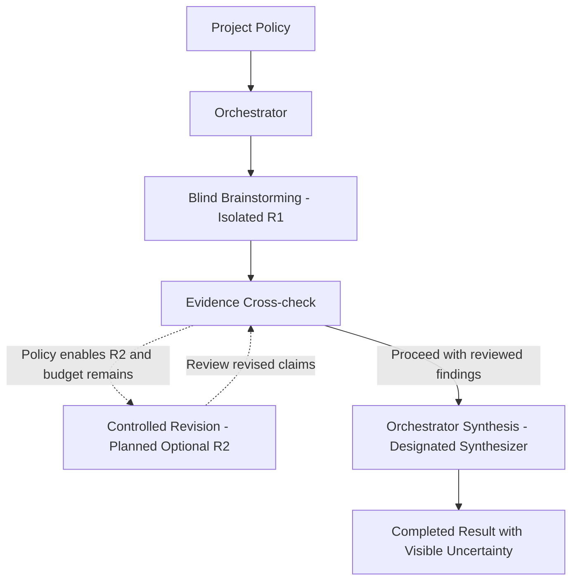

# Governed Interaction Model

**Architecture version: 1.1**

These notes complement the [README](README.md). They describe the three-phase baseline and a planned optional revision extension. The public repository contains architecture documentation; the implementation remains private.

## The problem with unrestricted agent conversation

Adding more agents does not automatically create better reasoning. When every worker can immediately see every other answer, a multi-agent system can converge faster on the same assumption, hide minority findings, duplicate work, or mistake agreement for verification.

Haiox Orchestrator uses a governed interaction model instead. The application owns the communication policy; participating models do not decide the workflow among themselves.

## High-level model

The baseline consists of blind brainstorming (R1), evidence cross-check, and orchestrator synthesis. Completion is the terminal outcome.

The optional R2 path is a planned architectural extension, not a documented capability of the current private prototype. Roles, visibility rules, and synthesis provider may vary by project policy. Information always moves through explicit application-controlled boundaries. Failure and cancellation paths for all active phases appear in the README execution diagram and are defined below.

## Public principles

### 1. Isolated first-pass reasoning

Workers begin from the same task and approved context without seeing one another's first answer. This reduces anchoring and dominant-agent bias.

### 2. Evidence before consensus

Claims, assumptions, contradictions, uncertainty, and references are represented as structured evidence before final synthesis.

### 3. Governed visibility

A worker receives only the information permitted for its current phase. Later rounds may reveal selected conflicts or evidence without exposing every participant's full reasoning history.

### 4. Controlled revision

In the planned optional R2 extension, revision occurs as a distinct phase with the conceptual input contract and bounded transition rules below. Agents do not continuously overwrite one another's direction.

### 5. Designated synthesis

The synthesizer is replaceable and provider-independent. It receives normalized outputs and evidence records; it does not become the workflow control plane.

### 6. Explicit terminal paths

Completion, failure, and cancellation are application states. Planned hardening includes bounded retries, cost controls, checkpoints, and fallback policies.

## Conceptual phase contracts

These contracts describe the meaning of inputs and outputs. They do not publish executable schemas, prompts, or exact disclosure rules.

| Phase | Permitted input | Output and transition |
| --- | --- | --- |
| Blind brainstorming (R1) | The same task, constraints, and approved context, plus each worker's assigned role; no other worker's first answer. | Independent findings with distinguishable claims, assumptions, and uncertainty; passed to evidence cross-check. |
| Evidence cross-check | The task, normalized findings, available source references, and permitted supporting material. | Reviewed claims, evidence records, conflicts, and missing support; sent to synthesis or the planned optional R2 path. |
| Controlled revision (planned optional R2) | The task and constraints, the worker's own prior findings, selected review findings and evidence, and the remaining revision scope or budget. | Revised findings that identify changed claims and outstanding uncertainty; returned to evidence cross-check. Exact selection and disclosure rules remain private. |
| Orchestrator synthesis | The task, normalized findings, reviewed evidence records, and unresolved conflicts, including reviewed revisions when present. | A final result that preserves unsupported claims and unresolved disagreements as uncertainty rather than presenting them as verified facts. |

### Conceptual evidence contract

An evidence record connects a claim to inspectable support or a documented lack of support. Model agreement, repeated answers, and confidence scores alone do not establish verification.

| Element | Meaning |
| --- | --- |
| Claim and origin | The proposition being reviewed and the worker output or revision it came from. |
| Support or contradiction | The relevant source excerpt, observation, or technical check and how it bears on the claim. |
| Reference and provenance | A source identifier or locator sufficient to trace the material, with context or retrieval time when relevant. Derived summaries are labeled as derived and retain a link to their underlying source. |
| Assessment | Whether the available material supports, contradicts, or leaves the claim unresolved; assumptions remain distinguishable from observations. |
| Uncertainty and confidence | Missing information, limitations, and any confidence assessment with its basis. Confidence is not a calibrated probability unless a calibration basis is supplied. |
| Conflict linkage | The competing claim or record involved in a disagreement; the relationship stays visible through synthesis. |

Illustrative example only: Worker A claims that a service supports offline operation. An approved source excerpt says that an internet connection is required, so the review records a contradiction with a reference to that excerpt. Worker B's agreement with Worker A does not count as independent supporting evidence. If the source cannot be inspected, the claim remains unresolved. A review error is recorded as an error or unresolved assessment, never converted into support.

### Planned R2 transition rules

The application, not a worker or the synthesizer, decides whether revision is allowed. R2 is eligible only when the project policy enables it, review identifies an issue that selected workers can address, and the configured revision budget remains. Examples include an unresolved contradiction, an unsupported claim, or a technical inconsistency. Exact trigger thresholds and selection rules remain private.

Every revised output returns to evidence cross-check. The next reviewed result proceeds to synthesis when no further revision is authorized or useful, or when the revision budget is exhausted. Remaining disagreement and missing support stay explicit; unanimity is not an exit requirement. Exhausting the revision budget is not itself a failure. If synthesis cannot meet required output conditions, the run follows the failure path instead of presenting an incomplete result as completed.

## Terminal-state contract

These are intended application semantics, not evidence that every cancellation or reliability mechanism has been implemented in the private prototype.

- **Completed:** the final result has met the required completion conditions and the application commits the terminal outcome.
- **Failed:** the application cannot satisfy the required execution or output conditions. Available partial findings remain labeled as partial.
- **Cancelled:** the application accepts cancellation before a terminal outcome is committed. Cancellation is allowed from Idle and every active phase, including evidence review, planned R2, and synthesis.

A run has one terminal outcome. Once committed, that outcome does not change; a later cancellation request cannot replace Completed or Failed. If cancellation is accepted first, a late provider response cannot turn the run into Completed.

Cancellation ends further phase advancement and prevents publication of a new completed result for that run. Already-emitted partial events remain partial. The application requests that in-flight work stop where the provider supports it; this does not guarantee that a remote request has stopped or that incurred cost is reversed. The event stream reports the committed terminal outcome before closing. Provider responses do not independently decide completion, failure, or cancellation.

## Project Manager and Orchestrator

The planned Project Manager is the human-facing control surface. It expresses the objective, constraints, participants, review stages, and high-level interaction policy.

The Orchestrator is the enforcement layer. It owns phase transitions, isolation boundaries, event delivery, evidence flow, and synthesis coordination.

This separation supports the future SaaS direction: project owners configure a governed deliberation process while the execution engine applies it consistently across model providers.

## Intentionally private

This document does not publish executable policy schemas, internal prompts, routing and scoring logic, exact reveal rules, recovery algorithms, or private evaluation data.

## Status

Version 1.1 describes the public architectural direction. The README identifies the current private prototype separately from planned configurable R2, the Project Manager workspace, SaaS foundations, and reliability hardening. The conceptual contracts in this document do not constitute public implementation, test results, or a production-readiness claim.
