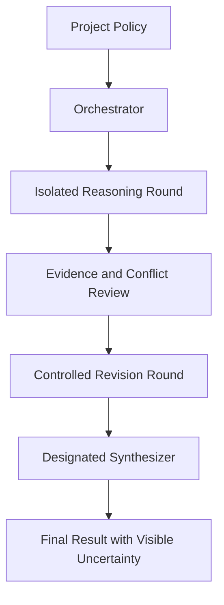

# Governed Interaction Model

## The problem with unrestricted agent conversation

Adding more agents does not automatically create better reasoning. When every worker can immediately see every other answer, a multi-agent system can converge faster on the same assumption, hide minority findings, duplicate work, or mistake agreement for verification.

AGInaz Orchestrator uses a governed interaction model instead. The application owns the communication policy; participating models do not decide the workflow among themselves.

## High-level model

The number of rounds, roles, visibility rules, and synthesis provider may vary by project policy. The invariant is that information moves through explicit boundaries rather than an uncontrolled shared conversation.

## Public principles

### 1. Isolated first-pass reasoning

Workers begin from the same task and approved context without seeing one another's first answer. This reduces anchoring and dominant-agent bias.

### 2. Evidence before consensus

Claims, assumptions, contradictions, uncertainty, and references are represented as structured evidence before final synthesis.

### 3. Governed visibility

A worker receives only the information permitted for its current phase. Later rounds may reveal selected conflicts or evidence without exposing every participant's full reasoning history.

### 4. Controlled revision

Revision occurs as a distinct phase with a defined input contract. Agents do not continuously overwrite one another's direction.

### 5. Designated synthesis

The synthesizer is replaceable and provider-independent. It receives normalized outputs and evidence records; it does not become the workflow control plane.

### 6. Explicit terminal paths

Completion, failure, and cancellation are application states. Planned hardening includes bounded retries, cost controls, checkpoints, and fallback policies.

## Project Manager and Orchestrator

The planned Project Manager is the human-facing control surface. It expresses the objective, constraints, participants, review stages, and high-level interaction policy.

The Orchestrator is the enforcement layer. It owns phase transitions, isolation boundaries, event delivery, evidence flow, and synthesis coordination.

This separation supports the future SaaS direction: project owners configure a governed deliberation process while the execution engine applies it consistently across model providers.

## Intentionally private

This document does not publish executable policy schemas, internal prompts, routing and scoring logic, exact reveal rules, recovery algorithms, or private evaluation data.

## Status

Version 1.1 describes the public architectural direction. It is not a claim that the planned SaaS surface or every reliability mechanism is production-ready today.
