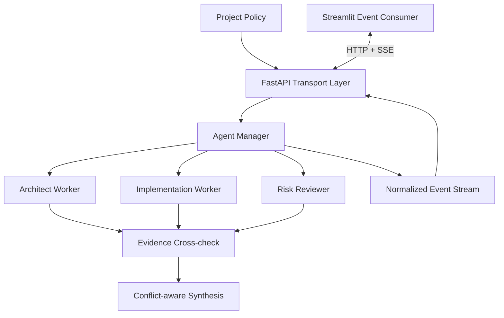
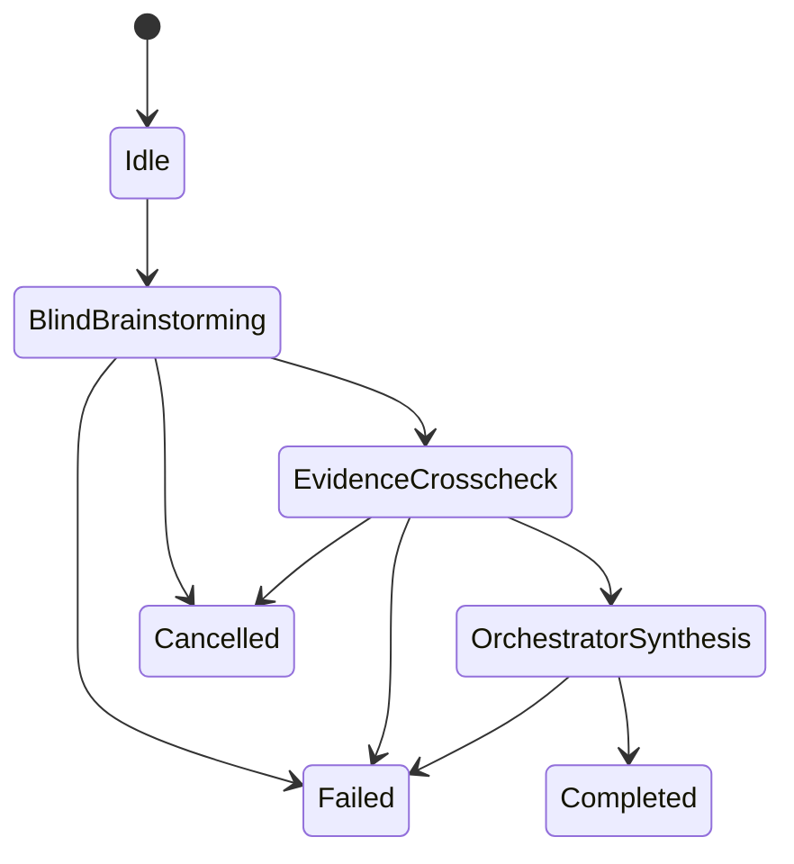

# Haiox Orchestrator — Architecture

Previously published as **AGInaz Orchestrator**; older GitHub links redirect here.

Public architecture notes for a governed, evidence-aware, provider-independent multi-agent orchestration system.

> This repository documents the architecture and engineering decisions. The implementation remains private.

**Architecture version: 1.1**

## Why this project exists

Multi-agent demos are easy to assemble; reliable multi-agent workflows are harder. Letting agents talk freely can amplify anchoring, premature consensus, duplicated work, and hidden disagreement.

Haiox Orchestrator treats agent execution as a governed workflow with explicit state, isolated workers, structured evidence, normalized events, and conflict-aware synthesis. The application—not an individual model—controls who can see what, when a phase may advance, and how competing findings reach the final synthesis.

The goal is to make the system observable, testable, and replaceable at every boundary instead of coupling the product to one model provider or an uncontrolled conversation loop.

## Product direction

Haiox Orchestrator is evolving toward a governed multi-agent brainstorming workspace: a SaaS environment where a project owner can configure the high-level interaction policy for a run without surrendering workflow control to the participating models.

The intended experience separates two responsibilities:

- **Project Manager:** captures the objective, constraints, participants, review stages, and high-level visibility rules.
- **Orchestrator:** enforces the resulting execution policy across isolated workers, evidence review, and controlled synthesis.

This direction is not another free-form agent group chat. It is a control plane for structured deliberation.

## System overview

## Execution model

1. **Blind brainstorming** — specialized workers receive the same task independently to reduce anchoring and dominant-agent bias.
2. **Evidence cross-check** — reviewers inspect claims, assumptions, contradictions, and technical consistency.
3. **Orchestrator synthesis** — the final model receives the task, independent outputs, evidence records, and detected conflicts.
4. **Completion** — the backend emits a terminal event and closes the stream.

The interaction model is described in [INTERACTION_MODEL.md](INTERACTION_MODEL.md).

## Core engineering decisions

- **Provider independence:** model-specific responses are normalized behind a common worker contract.
- **Strict agent isolation:** workers do not see one another's output during the first phase.
- **Evidence as data:** support, contradiction, uncertainty, confidence, and references are represented as structured records.
- **Orchestrator neutrality:** the application owns execution policy; no model provider becomes the control plane.
- **Explicit state:** every run has deterministic phases and terminal failure/cancellation paths.
- **Event-driven UI:** the frontend consumes application events, never raw provider responses.
- **Governed visibility:** information is disclosed according to phase boundaries rather than through unrestricted agent-to-agent chat.
- **Controlled disagreement:** conflicting findings remain visible until a designated synthesis phase resolves or preserves them.

## Current private prototype

The private MVP includes asynchronous agent management, concurrent isolated workers, provider-independent worker abstraction, structured evidence cross-checking, conflict-aware synthesis, normalized events over Server-Sent Events, FastAPI transport, and a Streamlit event consumer.

It is currently a single-instance portfolio prototype—not a claim of horizontally scalable production readiness.

## Public/private boundary

This repository intentionally excludes source code, internal prompts, credentials, exact policy schemas, reveal rules, evaluation heuristics, routing and scoring logic, private evaluation data, and production configuration.

## Roadmap

- persistent run storage and distributed event transport;
- authentication, authorization, observability, and audit trails;
- configurable interaction policies and governed multi-round deliberation;
- execution leases, checkpoint-aware recovery, and bounded retry budgets;
- Project Manager workspace and reusable workflow templates;
- automated evaluation, integration tests, and containerized deployment;
- multi-tenant SaaS foundations, including tenancy, billing boundaries, and policy isolation.

## Related Haiox projects

- [Haiox Smart Miner](https://github.com/haiox/Haiox_Smart_Miner) — validated web extraction for structured inputs.
- [Haiox DePIN Research Agent](https://github.com/haiox/Haiox_DePIN_Research_Agent) — evidence-first research and risk analysis.
- [Haiox MultiAgent](https://github.com/haiox/Haiox_MultiAgent) — multi-model coordination with retrieval capabilities.

## Status

Architecture showcase — active development. Version 1.1 documents the governed-interaction direction while the implementation remains private.

## Contact

- GitHub: [Haiox](https://github.com/haiox)
- X: [@aginaz_](https://x.com/aginaz_)
