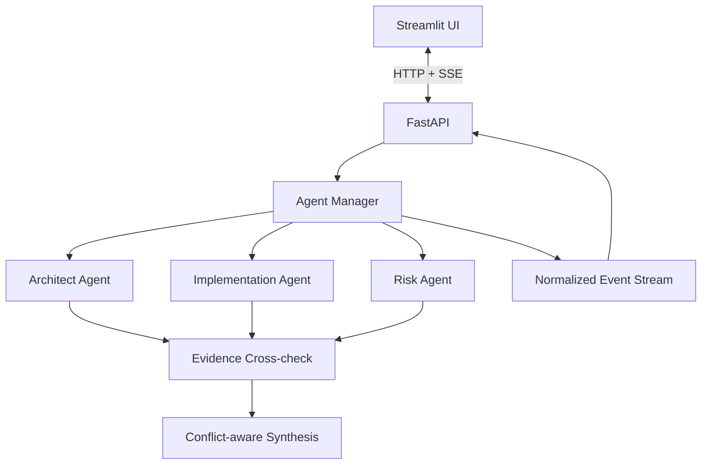
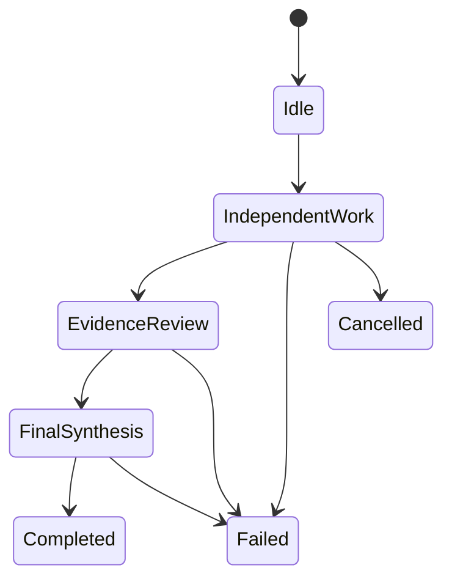

# AGInaz Orchestrator — Architecture

Public architecture notes for an evidence-aware, provider-independent multi-agent system.

> This repository explains the design. The implementation, prompts, and internal policies remain private.

## The idea in one minute

Most multi-agent demos let models talk freely and hope they reach a good answer. AGInaz uses a controlled workflow instead:

1. Specialist agents solve the same task independently.
2. Reviewer agents check claims, assumptions, and contradictions.
3. The orchestrator combines the useful parts, explains conflicts, and keeps uncertainty visible.
4. The UI receives clean system events—not raw provider responses.

This makes the workflow easier to inspect, test, extend, and move between model providers.

## High-level architecture

## Execution flow

## Core design choices

- **Independent first pass:** agents do not see each other’s answers at the start, reducing anchoring and groupthink.
- **Evidence before confidence:** a conclusion is not accepted simply because a model sounds certain.
- **Conflict-aware synthesis:** disagreements are reviewed and surfaced instead of silently averaged away.
- **Provider independence:** every model sits behind the same worker boundary.
- **Application-controlled orchestration:** models reason; AGInaz controls the workflow.
- **Normalized events:** the frontend reads one stable event format regardless of provider.

## Architecture layers

| Layer | Responsibility |
|---|---|
| Streamlit UI | Displays normalized run events |
| FastAPI | Starts, inspects, streams, and cancels runs |
| Agent Manager | Controls state, concurrency, and sequencing |
| Workers | Adapt different model providers to one contract |
| Evidence Review | Marks support, contradiction, and uncertainty |
| Synthesis | Produces the final answer with risks and unresolved questions |

## Current private prototype

The private MVP includes async execution, isolated specialist agents, structured evidence review, conflict-aware synthesis, FastAPI transport, Server-Sent Events, a Streamlit event consumer, and provider-independent workers.

It is currently a single-instance portfolio prototype. Persistent storage, shared event infrastructure, authentication, observability, cost controls, retries, provider fallback, automated tests, and container deployment are on the roadmap.

## Public/private boundary

This public repository intentionally contains no source code, prompts, credentials, production endpoints, private evaluation data, or proprietary routing and scoring logic.

## Related AGInaz projects

- [Smart Miner](https://github.com/Hatef-AGInaz/AGInaz_Smart_Miner) — collects and validates structured web data.
- [DePIN Research Agent](https://github.com/Hatef-AGInaz/AGInaz_DePIN_Research_Agent) — analyzes claims, tokenomics, and risk with evidence.
- [MultiAgent](https://github.com/Hatef-AGInaz/AGInaz_MultiAgent) — coordinates multiple models with retrieval capabilities.

Together they tell one story: collect reliable inputs, analyze and verify them, coordinate specialists, and control execution through an observable orchestration layer.

## Contact

- GitHub: [Hatef-AGInaz](https://github.com/Hatef-AGInaz)
- X: [@aginaz_ai](https://x.com/aginaz_ai)
